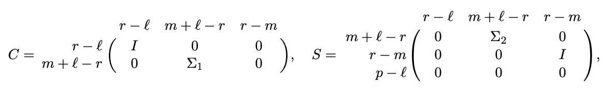

# GeneralizedSVD.jl

*Prepared by Ji Wang and Zhaojun Bai (jiiwang, zbai@ucdavis.edu)*

`GeneralizedSVD.jl` is a Julia program to compute the following
generalized singular value decomposition (GSVD)
of an $m$-by-$n$ matrix $A$ and a $p$-by-$n$ matrix $B$
defined in LAPACK [^1].
```math
\begin{aligned}
A = UCRQ^T, \quad B = VSRQ^T
\end{aligned}
```
where $U$, $V$ and $Q$ are $m$-by-$m$, $p$-by-$p$ and $n$-by-$n$
orthogonal matrices, respectively.
$R = \left[  \begin{array}{cc}
         0 & R_1
        \end{array} \right]$ is $r$-by-$n$
and $R_1$ is $r$-by-$r$ is upper triangular and nonsingular,
where $r = \text{rank}([A; B]) \leq n$.
$C$ and $S$ are $m$-by-$r$ and $p$-by-$r$
real, non-negative and diagonal matrices, respectively,
and $C^T C + S^T S = I_{r}$.
Specifically, $C$ and $S$ have the following structures:
* if $m \geq r$:

```@raw html

```

* if $m < r$:  

```@raw html

```
where $\Sigma_1$ and $\Sigma_2$ are nonnegative diagonal matrices,
$\Sigma_2$ is nonsingular and $\ell = \text{rank}(B)$.

`gsvd(A, B)` returns an object `F` such that
- `F.U` is the $m$-by-$m$ orthogonal matrix $U$,
- `F.V` is the $p$-by-$p$ orthogonal matrix $V$,
- `F.Q` is the $n$-by-$n$ orthogonal matrix $Q$,
- `F.R1` is the $r$-by-$r$ nonsingular upper
      triangular matrix $R_1$ in the $r$-by-$n$ matrix $R$,
- `F.alpha` and `F.beta` are arrays of length $r$ to
      store the diagonal elements of $C$ and $S$, respectively.
- `F.k` and `F.l` are integers such that
      $r$ = `F.k` + `F.l` is the rank of $[A; B]$.

The diagonals of $C$ and $S$ can be stored in arrays `F.alpha` and `F.beta` of length ``r`` as follows.
+ if ``m \geq r``:
```math
\begin{aligned}
    {\tt F.alpha[1]} & =  \cdots = {\tt F.alpha[r-l]} = 1, \,\,
	{\tt F.alpha[r-l+i]} = (\Sigma_1)_{ii} \,\,
	\text{for $i = 1, \cdots, \ell$}, \\  
	{\tt F.beta[1]} & = \cdots = {\tt F.beta[r-l]} = 0, \,\,
	{\tt F.beta[r-l+i]} = (\Sigma_2)_{ii} \,\,
	\text{for $i = 1, \cdots, \ell$}.
\end{aligned}
```
+ if ``m < r``:
```math
\begin{aligned}
    {\tt F.alpha[1]} & = \cdots = {\tt F.alpha[r-l]} = 1, \,\,
	{\tt F.alpha[r-l+i]} = (\Sigma_1)_{ii} \,\,
	\text{for $i = 1, \cdots, m+\ell-r$}, \\
	{\tt F.alpha[m+1]} &= \cdots = {\tt F.alpha[r]} = 0, \\
 	{\tt F.beta[1]} & = \cdots = {\tt F.beta[r-l]} = 0, \,\,
	{\tt F.beta[r-l+i]} = (\Sigma_2)_{ii} \,\, \text{for $i = 1, \cdots, m+\ell-r$}, \\
	{\tt F.beta[m+1]} &= \cdots = {\tt F.beta[r]} = 1.
\end{aligned}
```
In addition,  `F.C`, `F.S`, and `F.R`
returns the matrices $C$, $S$ and $R$ explicitly.

The ratios `F.vals[i]` $\equiv$ `F.alpha[i]/F.beta[i]` for $i = 1, \ldots, r$ are called the **generalized singular values (gsv)** of $(A, B)$.

## Example
Here's an example of how to use `GeneralizedSVD.jl`.

```julia
julia> using GeneralizedSVD

julia> A = [1. 2 3 0; 5 4 2 1; 0 3 5 2; 2 1 3 3; 2 0 5 3];
julia> B = [1. 0 3 -1; -2 5 0 1; 4 2 -1 2];

julia> F = gsvd(A, B);

julia> F.C
5×4 SparseArrays.SparseMatrixCSC{Float64,Int64} with 4 stored entries:
  [1, 1]  =  1.0
  [2, 2]  =  0.894685
  [3, 3]  =  0.600408
  [4, 4]  =  0.27751

julia> F.S
3×4 SparseArrays.SparseMatrixCSC{Float64,Int64} with 3 stored entries:
  [1, 2]  =  0.446698
  [2, 3]  =  0.799694
  [3, 4]  =  0.960723

julia> F.R
4×4 Array{Float64,2}:
 5.74065  -7.07986   0.125979  -0.316232
 0.0      -7.96103  -2.11852   -2.98601
 0.0       0.0       5.72211   -0.43623
 0.0       0.0       0.0        5.66474

julia> [A; B] ≈ [F.U*F.C; F.V*F.S]*F.R*F.Q'
true
```

## Algorithm
`GeneralizedSVD.jl` is an implementation of a four-step algorithm using
LAPACK routine `DGGSVD3` for pre-processing and
a specialized 2-by-1 CS decomposition due to Van Loan [^2].

## `GeneralizedSVD` module
`GeneralizedSVD.jl` is in the `GeneralizedSVD` module, which consists of
```
|── src
|     |── GeneralizedSVD.jl
|     └── preproc.jl
|     └── householderqr.jl
|     └── csd.jl
|── test
|     |── ...
```
The main function `gsvd(A, B)`
calls `preproc`, `householderqr`, `csd2by1`,
and then post-process for implementing the four-step
algorithm.

## Installation
To install `GeneralizedSVD`,
from the Julia REPL, type `]` to enter the Pkg REPL mode and run:
```
pkg> add GeneralizedSVD
```

or using the `Pkg` API:

```julia
julia> import Pkg; Pkg.add("GeneralizedSVD")
```

## Performance
`gsvd(A,B)` exhibits the same numerical stability
as `svd(A, B)`, a wrapper to LAPACK routine `DGGSVD3`
available in Julia 1.3 on a large set of random matrices of
different dimensions.  
The following plots show that for large matrices, `gsvd(A, B)` is
up to 15$\times$ faster than `svd(A, B)`.
However, for matrices of dimensions small than 40, `gsvd(A, B)`
is slightly slower.

```@raw html
<table border="0"><tr>
<td>
	<figure>
		<br>
	</figure>
</td>
<td>
	<figure>
		<br>
	</figure>
</td>
</tr></table>

<br/>
<table border="0"><tr>
<td>
	<figure>
		<br>
	</figure>
</td>
<td>
	<figure>
		<br>
	</figure>
</td>
</tr></table>
```

## Properties of GSVD
When $B$ is square and nonsingular,
the GSVD of $(A,B)$ is equivalent to the SVD of $AB^{-1}$:
```math
\begin{aligned}
    A B^{-1} = U (CS^{-1}) V^T
\end{aligned}
```

If we rewrite the GSVD as

``A\left[\begin{array}{cc}Q_1 & Q_2\end{array}\right] = UC\left[\begin{array}{cc}0 & R_1\end{array} \right], \quad B\left[\begin{array}{cc}Q_1 & Q_2\end{array}\right] = UC\left[\begin{array}{cc}0 & R_1\end{array} \right]``
where $Q_1$ is $n$-by-($n-r$) and $Q_2$ is $n$-by-$r$,
then null$(A)\cap$ null($B$) = span\{$Q_1$\}
i.e., $Q_1$ is an orthonormal basis
of the common nullspace of $A$ and $B$.

By the GSVD of $(A, B)$, the matrices $A^TA$ and $B^TB$
are simultaenously diagonalized under the congruence transformation:
```math
\begin{aligned}
    X^TA^TAX = \begin{bmatrix}
            0 & 0 \\
            0 & C^TC
             \end{bmatrix},  \quad
    X^TB^TBX = \begin{bmatrix}
                0 & 0 \\
                0 & S^TS
             \end{bmatrix}
\end{aligned}
```
where
```math
\begin{aligned}
X = Q \begin{bmatrix}
	I & \\
  	&  R_{1}^{-1}
\end{bmatrix}.
\end{aligned}
```
Consequently, the non-trivial eigenpairs of $(A^TA, B^TB)$ are given by
```math
\begin{aligned}
A^TAX_{i+n-r} = \lambda_{i} B^TBX_{i+n-r},
\end{aligned}
```
where for $i = 1, \cdots, r$,
$\lambda_i = \sigma^2_i$ are the generalized
singular values of $(A, B)$ and
$X_{i+n-r}$ is the $(i+n-r)$-th column of $X$.

*The aforementioned properties are presented
in most definitions of the generalized singular value decomposition
in literature, except MATLAB.*

## `GeneralizedSVD.jl` VS. `gsvd.m`
In MATLAB [^3], the GSVD of an $m$-by-$n$ matrix $A$ and
a $p$-by-$n$ matrix $B$ is defined by
```math
\begin{aligned}
A = UCX^T, \quad B = VSX^T
\end{aligned}
```
where
$U$ and $V$ are $m$-by-$m$ and $p$-by-$p$ orthogonal matrices,
respectively.
$X$ is $n$-by-$q$, where $q = \min\{m + p, n\}$.
$C$ and $S$ are $m$-by-$q$ and $p$-by-$q$ nonnegative diagonal
matrices and $C^T C + S^T S = I$.
The nonzero elements of $S$ are always on its main diagonal.
The nonzero elements of $C$ are on the diagonal
$\text{diag}(C, \max\{0,q-m\})$. If $m \geq q$, this is the main diagonal of $C$.
If $m < q$, the upper right $m$-by-$m$ block of $C$ is diagonal [^4].

Let $C^T C$ = diag$(\alpha_1^{2}, \cdots, \alpha_q^{2})$, and
$S^T S = \text{diag}(\beta_1^{2}, \cdots, \beta_q^{2})$ for $i = 1, \ldots, q$.
The ratios $\alpha_i/\beta_i$ are the generalized singular values of
$(A, B)$.

As shown by the following example,  the GSVD defined in MATLAB:
- does not reveal the rank of $[A;B]$,
- does not simultaneously diagonalize the matrices $A^TA$ and $B^TB$ under the congruence transformation. Therefore it may not have the relation with the non-trivial eigenpairs of $(A^TA, B^T B)$.

### Example of `GeneralizedSVD.jl` vs. `gsvd.m`
Consider
```math
    \begin{aligned}
        A = \begin{bmatrix}
            0 & -\frac{3}{8} & 0 & \frac{\sqrt{3}}{8}\\
            -\frac{3}{8} & 0 & \frac{\sqrt{3}}{8} & 0\\
            0 & -\frac{3\sqrt{3}}{8} & 0 & \frac{3}{8}\\
            \frac{\sqrt{3}}{8} & 0 & -\frac{1}{8} & 0
        \end{bmatrix}, \quad
        B = \begin{bmatrix}
            0 & \frac{\sqrt{3}}{8} & 0 & \frac{7}{8}\\
            -\frac{3\sqrt{3}}{8} & 0 & \frac{3}{8} & 0\\
            0 & -\frac{5}{8} & 0 & -\frac{\sqrt{3}}{8}\\
            \frac{3}{8} & 0 & -\frac{\sqrt{3}}{8} & 0
        \end{bmatrix}
    \end{aligned}
```
where $\text{rank}(A) = 2$, $\text{rank}(B) = 3$ and $\text{rank}([A;B]) = 3$.
The exact GSVD of $(A,B)$ as defined in LAPACK is given by

```math
\begin{aligned}
U = V = Q = \begin{bmatrix}
            \frac{1}{2} & 0 & \frac{\sqrt{3}}{2} & 0 \\
            0  & -\frac{\sqrt{3}}{2} & 0 & \frac{1}{2} \\
            \frac{\sqrt{3}}{2}  & 0  & -\frac{1}{2} & 0 \\
            0 & \frac{1}{2} & 0 & \frac{\sqrt{3}}{2} \\
      \end{bmatrix},  \quad
R_1 =  I_{3}, \quad
C = \begin{bmatrix}
	\frac{\sqrt{3}}{2} & 0 & 0 \\
	0 & \frac{1}{2} & 0 \\
	0 & 0 & 0 \\
	0 & 0 & 0 \\
	\end{bmatrix},  
	\quad
S = \begin{bmatrix}
	\frac{1}{2} & 0 & 0 \\
	0 & \frac{\sqrt{3}}{2} & 0 \\
	0 & 0 & 1 \\
	0 & 0 & 0 \\
	\end{bmatrix}
\end{aligned}
```
Therefore, the generalized singular values are
$\sigma_1 = \sqrt{3}$,
$\sigma_2 = \frac{1}{\sqrt{3}}$,
$\sigma_3 = \frac{0}{1} = 0$.
Furthermore, the non-trivial eigenvalues of $(A^TA, B^T B)$
are $\lambda_1 = 3, \lambda_2 = \frac{1}{3}, \lambda_3 = 0$.

By `GeneralizedSVD.jl`, we have
```julia
julia> F.U =
4×4 Array{Float64,2}:
 0.5        0.0      -0.866025   0.0     
 0.0       -0.866025  0.0        0.5     
 0.866025   0.0       0.5        0.0     
 0.0        0.5       0.0        0.866025
julia> F.V
4×4 Array{Float64,2}:
 0.5        0.0       -0.866025  0.0     
 0.0       -0.866025   0.0       0.5     
 0.866025   0.0        0.5       0.0     
 0.0        0.5        0.0       0.866025
julia> F.Q
4×4 Array{Float64,2}:
 0.5        0.0        0.866025   0.0     
 0.0       -0.866025   0.0       -0.5     
 0.866025   0.0       -0.5        0.0     
 0.0        0.5        0.0       -0.866025
julia> F.R1
3×3 Array{Float64,2}:
 1.0  0.0  2.22045e-16
 0.0  1.0  0.0        
 0.0  0.0  1.0
julia> F.alpha
3-element Array{Float64,1}:
 0.8660254037844384
 0.5               
 0.0
julia> F.beta   
3-element Array{Float64,1}:
 0.5               
 0.8660254037844384
 1.0000000000000002
julia> F.k
0
julia> F.l
3
```
Consequently, the numerical rank of $[A;B]$ is
`F.k` + `F.l` = 3 and the generalized singular values
of $(A, B)$ are:
```math
\begin{aligned}
{\tt F.alpha}[1]/{\tt F.beta}[1] & = 1.7321 \approx \sigma_1 = \sqrt{3} \\
{\tt F.alpha}[2]/{\tt F.beta}[2] & = 0.5774 \approx \sigma_2 = \frac{1}{\sqrt{3}} \\
{\tt F.alpha}[3]/{\tt F.beta}[3] & = 0.0  = \sigma_3 = 0,  
\end{aligned}
```
and agree with the exact generalized singular values up to machine precision.

In contrast, by MATLAB's `gsvd.m`, we have
```matlab
>> U =
    0.4899    0.0848   -0.1131    0.8602
    0.4123   -0.8944   -0.0750   -0.1565
   -0.2829   -0.0573   -0.9566    0.0409
    0.7141    0.4355   -0.2580   -0.4836

>> V =
   -0.8660   -0.0110   -0.4943    0.0742
   -0.0000   -0.8584    0.0947    0.5042
    0.5000   -0.0190   -0.8562    0.1285
   -0.0000    0.5126    0.1163    0.8507

>> X =
         0    0.8641   -0.0330   -0.0468
   -0.5000    0.0109    0.7898   -0.3550
   -0.0000   -0.4989    0.0190    0.0270
   -0.8660   -0.0063   -0.4560    0.2050

>> C =
    0.0000         0         0         0
         0    0.4972         0         0
         0         0    0.8404         0
         0         0         0    0.9835
>> S =
    1.0000         0         0         0
         0    0.8676         0         0
         0         0    0.5420         0
         0         0         0    0.1809
```
Consequently, the generalized singular values computed by `gsvd.m` are
$0, 0.5731,  1.5504, 5.4352$, which have no connection with
the non-trivial eigenvalues of $(A^{T}A, B^{T}B)$.  

[^1]:
    Edward Anderson, Zhaojun Bai, Christian Bischof, L Susan Blackford, James Demmel, Jack Dongarra, Jeremy Du Croz, Anne Greenbaum, Sven Hammarling, Alan McKenney, et al. LAPACK Users’ guide. SIAM, 1999.

[^2]:
    Charles Van Loan. Computing the CS and the generalized singular value decompositions. Numerische Mathematik, 46(4):479–491, 1985.

[^3]:
    MATLAB. Generalized singular value decomposition documentation. The MathWorks Inc., Natick, Massachusetts, 2019. Available at https://www.mathworks.com/help/matlab/ref/ gsvd.html.

[^4]:
    This is not in MATLAB's description of the GSVD.
